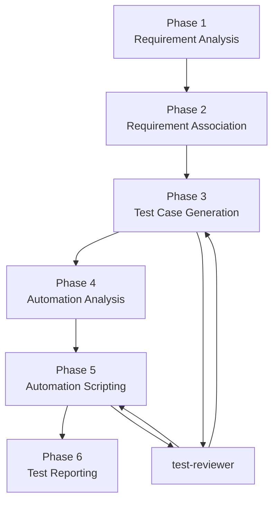
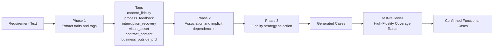
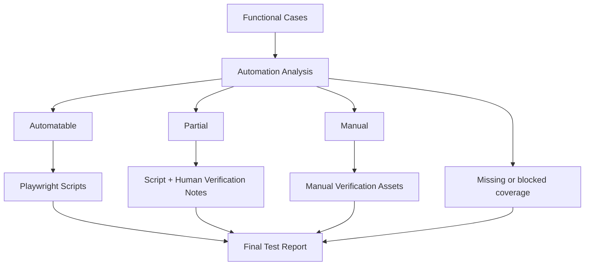

# Supertester

面向 Claude Code 的测试工作流插件。它把需求分析、测试设计、自动化可行性判断、脚本生成和最终报告串成一条可追踪、可恢复、可审查的流程，而不是一次性输出一批测试内容。

当前仓库的核心不是传统 `src/` 应用，而是一套由 `skills/`、`hooks/`、`templates/` 和 `agents/` 组成的测试能力编排资产。

## Installation

Supertester 提供了 Claude Code 可用的插件市场元数据。

在 Claude Code 中，先注册 marketplace：

```bash
/plugin marketplace add supertester-ai/supertester
```

然后从该 marketplace 安装插件：

```bash
/plugin install supertester@supertester
```

如果你不走 marketplace，也可以直接从 git 仓库安装：

```bash
/plugin add https://github.com/supertester-ai/supertester.git
```

详细说明见 [`docs/installation.md`](docs/installation.md)。

## 它解决什么问题

Supertester 适合这类场景：

- 需要从需求文档稳定地产出功能测试用例
- 希望把测试分析过程沉淀为可追踪文件，而不是只留在会话上下文里
- 需要区分 `automatable`、`partial`、`manual`，而不是强行把所有场景自动化
- 希望在生成测试资产前后都加入质量门禁，而不是“生成完就算完成”
- 需要跨会话恢复测试设计工作，或者让不同 agent 协作完成同一条测试链路

## 核心设计

- 需求优先：不理解需求，不进入后续测试资产生成
- 文件持久化：关键决策和阶段产物写入 `.supertester/`
- 分阶段生成：先功能测试设计，再自动化分析，再脚本生成
- 独立审查：由 `test-reviewer` 负责质量门禁，生成和审查角色分离
- 保留人工资产：对视觉、媒体、复杂内容、人工判断场景保留 `manual` 或 `partial`
- 通用化规则：规则面向跨业务复用，不绑定某个具体产品域

## 工作流总览

Supertester 当前采用 6 个主阶段：

1. 需求解析与澄清
2. 需求关联与跨模块分析
3. 功能测试用例生成
4. 自动化可行性分析
5. Playwright 脚本生成
6. 测试报告生成



## 高保真测试设计

Supertester 不只追求"行为覆盖"，还会显式保护高价值测试资产，避免在泛化生成时把重要细节抹平。

Phase 1 到 Phase 3 会使用 6 类显式特性标签，用来识别那些不能被"正常流程覆盖"替代的测试资产：

- `content_fidelity`
- `process_feedback`
- `interruption_recovery`
- `visual_asset`
- `contract_content`
- `business_outside_prd`

这些标签会影响后续的澄清问题、关联分析、用例生成粒度和 reviewer 的审查重点。

此外，流程中还会显式分析两类常见但容易漏掉的通用能力：

- `interruption_recovery`
- `history_interaction`

它们不是针对某个具体业务写的，而是针对一类常见产品行为模式：处理中可中断、结果沉淀到列表/记录、列表存在分页排序滚动与可见性要求。

## 高保真资产如何流转



## 用例生成的关键变化

新版 `test-case-generation` 不再只根据需求类型选生成器，还会先决定保真度策略。当前支持的策略模式包括：

- `enumeration_mode`
- `content_fidelity_mode`
- `process_mode`
- `interruption_mode`
- `visual_fallback_mode`
- `history_interaction_mode`
- `contract_content_mode`

这套模式解决的是"测什么"和"测到多细"之间的断层问题：

- 列表、本体枚举、矩阵规则不再被随意抽样
- loading、processing、staged feedback 不再只测最终态
- 刷新、中断、重试、切换上下文后的恢复行为会被显式建模
- 图片、Logo、媒体和布局类需求不会因为自动化困难而被静默丢弃
- prompt、schema、模板字段、输出路径等内容合约会被当作契约来测

## 审查机制

`agents/test-reviewer.md` 现在不仅看结构正确性，还会执行一层 "High-Fidelity Coverage Radar" 审查，重点检查：

- 内容保真是否被抽象掉
- 过程态是否只剩最终态验证
- 中断与恢复是否漏测
- 历史/列表交互是否漏掉分页、排序、滚动、空态
- 视觉/媒体资产是否被保留为 `manual` 或 `partial`
- prompt / schema / path / template 是否按合约验证
- PRD 外业务资产是否进入覆盖范围

其中一部分缺口会被直接提升为 `HIGH`，不能带着进入下一阶段。

## 自动化边界说明

Supertester 不要求所有测试都自动化。它会在 Phase 4 和 Phase 6 中明确区分：

- `automatable`
- `partial`
- `manual`
- `missing`

这让最终报告不只回答"写了多少用例"，还会回答"哪些资产能自动化、哪些必须保留人工判断、哪些仍存在缺口"。



## 仓库结构

```text
supertester/
|-- .claude-plugin/              # Claude Code 插件元数据
|-- agents/                      # 独立审查 agent
|-- docs/                        # 设计说明、分析报告、安装指南
|-- hooks/                       # SessionStart / Stop 等流程 hook
|-- scripts/                     # 初始化与恢复脚本
|-- skills/                      # Supertester 主流程技能
|-- templates/                   # .supertester/ 工作文件模板
|-- CLAUDE.md
|-- package.json
`-- README.md
```

当前核心技能包括：

- `using-supertester`
- `requirement-analysis`
- `requirement-association`
- `test-case-generation`
- `automation-analysis`
- `automation-scripting`
- `test-reporting`

## .supertester 产物目录

插件运行后，会在目标项目里维护 `.supertester/` 目录，用来保存上下文、阶段结果和审查记录。

```text
.supertester/
|-- test_plan.md
|-- findings.md
|-- progress.md
|-- requirements/
|   |-- parsed-requirements.md
|   |-- clarifications.json
|   |-- module-dependencies.md
|   |-- implicit-requirements.md
|   `-- cross-module-scenarios.md
|-- test-cases/
|   |-- functional-cases.md
|   |-- automation-analysis.md
|   `-- deduplication-report.md
|-- scripts/
|   |-- *.spec.ts
|   `-- manual-cases.md
|-- reviews/
`-- reports/
```

这套目录结构的意义，不只是"把结果写出来"，而是把测试设计过程也保存下来，方便后续恢复、审查和追溯。

## 组件分工

### Skills

`skills/` 是主流程层：

- `using-supertester`：入口初始化、路由与状态恢复
- `requirement-analysis`：需求解析、歧义发现、结构化澄清
- `requirement-association`：模块依赖、隐含需求、跨模块场景和恢复/历史交互分析
- `test-case-generation`：功能测试用例生成、保真度策略分配、去重
- `automation-analysis`：自动化可行性判断
- `automation-scripting`：Playwright 脚本生成
- `test-reporting`：汇总覆盖、边界和最终报告

### Hooks

`hooks/hooks.json` 负责在关键节点注入流程控制和上下文补偿，例如：

- 会话开始时初始化或恢复 `.supertester/`
- 用户继续任务前注入当前阶段上下文
- 编辑前后提醒同步进度
- 停止前检查流程是否处于可恢复状态

### Reviewer Agent

`agents/test-reviewer.md` 是独立质量门禁，不直接生成资产，只负责发现：

- 覆盖缺口
- 结构问题
- 高保真资产丢失
- 自动化边界误判

## 快速开始

安装后，可以直接给 Claude Code 下达自然语言任务，例如：

```text
分析 requirements/auth-prd.md，并生成测试方案
```

或者从中间阶段继续：

```text
基于现有功能用例，继续做自动化可行性分析
```

典型执行过程会是：

1. 初始化 `.supertester/`
2. 解析需求并产出结构化结果
3. 对歧义和 PRD 外关键规则进行澄清
4. 生成功能测试用例并经过 reviewer 审查
5. 分析自动化边界并生成脚本
6. 输出覆盖结构清晰的最终报告

## 适用边界

适合：

- 需求驱动的测试设计
- Web 产品的 E2E 测试规划与自动化脚本生成
- 需要追踪测试资产和决策链路的团队
- 需要保留人工校验资产而不是强推全自动化的场景

不等同于：

- 一个完整的测试执行平台
- 一个内置业务运行时代码的传统 Node 应用
- 一个所有场景都自动跑完的全托管测试系统

## 参考文档

- [安装指南](docs/installation.md)
- [设计说明](docs/design.md)
- [差异分析](docs/2026-04-08-comparison.md)
- [反向优化分析](docs/2026-04-09-supertester-optimization-analysis.md)

## License

MIT
